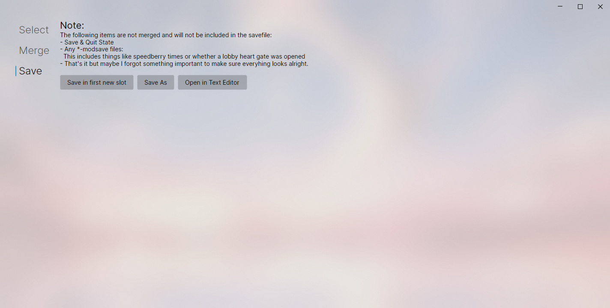

# Celeste Savefile Merger

<br clear="left" />
<br />


## Usage




## Development

**Build Program**

```sh
dotnet publish -o out
```

**Build Installer**

```sh
dotnet publish SaveMerger
dotnet build MsiPackage --configuration Release
ls MsiPackage/bin/Release/en-US/CelesteSaveMerger.msi
```
